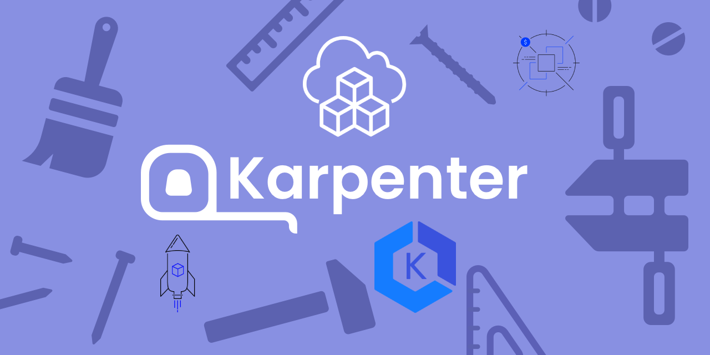

<p align="center">
  <a href="https://dev.to/vumdao">
    
  </a>
</p>
<h1 align="center">
  <div><b>AWS Karpenter Hands-on</b></div>
</h1>

## Abstract
- [Karpenter](https://karpenter.sh/) - Just-in-time Nodes for Any Kubernetes Cluster. It is one of Node-based autoscaling (adding or removing nodes as needed) beyond [cluster autoscaler](https://github.com/kubernetes/autoscaler/tree/master/cluster-autoscaler).
- What does this post provides?
  - Hands on installing karpenter on EKS Cluster
  - Provide permission of Karpenter to create AWS resources through IAM for service account (IRSA)
  - Create sample karpenter provisioner to test scaling-out and scaling down nodes by karpenter
  - Finally what Karpenter improvements vs cluster autoscaler.

## Table Of Contents
 * [Pre-requisite](#Pre-requisite)
 * [Create karpenter service account](#Create-karpenter-service-account)
 * [Install karpenter using helm chart](#Install-karpenter-using-helm-chart)
 * [Karpenter provisioner](#Karpenter-provisioner)
 * [Test karpenter scaleout nodes](#Test-karpenter-scaleout-nodes)
 * [Karpenter Deprovisioning](#Karpenter-Deprovisioning)
 * [Karpenter with AWS Node Termination Handler](#Karpenter-with-AWS-Node-Termination-Handler)
 * [Troubleshooting](#Troubleshooting)
 * [Karpenter improvements](#Karpenter-improvements)
 * [Clean-up workspace](#Clean-up-workspace)
 * [Conclusion](#Conclusion)

---

## 🚀 **Pre-requisite** <a name="Pre-requisite"></a>
- EKS cluster
- OIDC provider

## 🚀 **Create karpenter service account** <a name="Create-karpenter-service-account"></a>
- The best practice to provide AWS permission for Kubernetes service is [Using IAM Service Account Instead Of Instance Profile For EKS Pods](https://dev.to/vumdao/using-iam-service-account-instead-of-instance-profile-for-eks-pods-262p)
- If you already setup OIDC by using IAM identity provider then you can create the IAM role as service account for karpenter manually or using CDK. The role needs permission on EC2 actions only
    [kapenter-sa.ts](https://github.com/vumdao/aws-karpenter-hands-on/blob/master/src/karpenter-sa.ts)
    <details>
    <summary>kapenter-sa.ts</summary>

    ```


-
## 🚀 **Install karpenter using helm chart** <a name="Install-karpenter-using-helm-chart"></a>

## 🚀 **Karpenter provisioner** <a name="Karpenter-provisioner"></a>


---

References:
- [Deploy Amazon RDS databases for applications in Kubernetes](https://aws.amazon.com/blogs/database/deploy-amazon-rds-databases-for-applications-in-kubernetes/)


---

<h3 align="center">
  <a href="https://dev.to/vumdao">:stars: Blog</a>
  <span> · </span>
  <a href="https://github.com/vumdao/aws-ack-handson/">Github</a>
  <span> · </span>
  <a href="https://stackoverflow.com/users/11430272/vumdao">stackoverflow</a>
  <span> · </span>
  <a href="https://www.linkedin.com/in/vu-dao-9280ab43/">Linkedin</a>
  <span> · </span>
  <a href="https://www.linkedin.com/groups/12488649/">Group</a>
  <span> · </span>
  <a href="https://www.facebook.com/CloudOpz-104917804863956">Page</a>
  <span> · </span>
  <a href="https://twitter.com/VuDao81124667">Twitter :stars:</a>
</h3>
